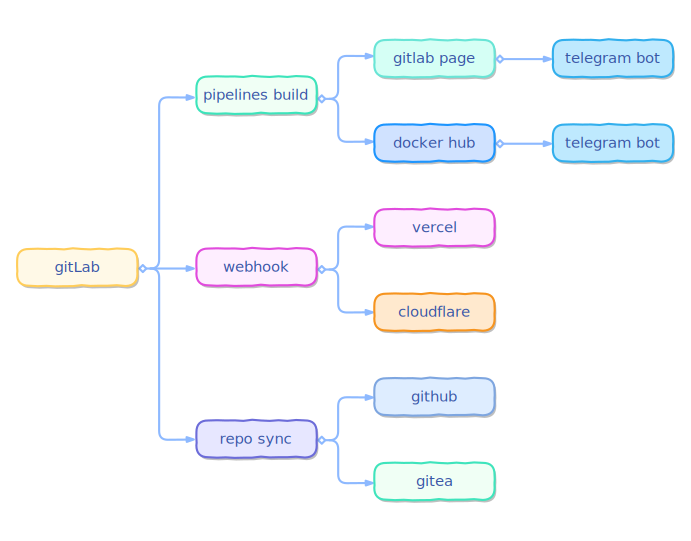

 |  | 

Do **NOT** contribute to this repo on github

## Deploy to

| platform | link | status |
| ------ | ------ | ------ |
| vercel | [https://lab.not.wiki](https://lab.not.wiki) |  |
| gitlab page | [https://lab.huxi.pub](https://lab.huxi.pub) |  |
| cloudflare | [https://lab.p0t.top](https://lab.p0t.top) |  |

## Flow chart

## Logo

## Element 

+ Mountain: peaks, courage
+ Water: waves, flow
+ Green: nature, hope
+ White: air, freedom

## License
